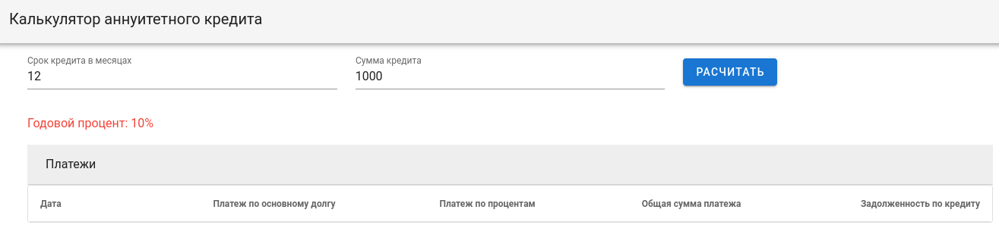

## Тестовое задание "Кредитный калькулятор" с использованием Spring-boot и Vue

1. [Само задание](doc/testjob.pdf)
1. [Опыт коллеги](https://habr.com/ru/post/467161/)
> В конце статьи [__Полезные ссылки__](https://habr.com/ru/post/467161/#Links
>) по авторизации, docker и пр. Много интересного. 

Использованы Spring Boot (v2.2.4), [__Vue__](https://ru.vuejs.org), [Vuetify](https://vuetifyjs.com)

#### Цель

Сделать приложение, содержащее SPA-клиент на Vue и backend на Spring Boot.
При этом разместить в одном maven проекте должны быть расположены и frontend
 и backend. 
 
#### Запуск

Backend:

```shell script
git clone https://github.com/cherepakhin/calculator-vue.git
cd calculator-vue/backend
mvn spring-boot:run
```

Frontend:

```shell script
cd calculator-vue/frontend
yarn serve
````

Проверить работу по адресу http://127.0.0.1:4000



#### Docker

Команды для работы с docker образом лежат в файлах _build.sh_ и _run-daemon.sh_. Настройка в Dockerfile.

```shell script
# Собрать образ с именем cherepakhin/calc-vue:v1 из Dockerfile в текущем каталоге(.)
# cherepakhin - https://hub.docker.com репозиторий
# calc-vue - имя образа
# v1 - метка, версия
sudo docker build -t cherepakhin/calc-vue:v1 .

# Загрузка В https://hub.docker.com
sudo docker push cherepakhin/calc-vue:v1

# Загрузка ИЗ https://hub.docker.com
sudo docker pull cherepakhin/calc-vue:v1

# Запуск образа cherepakhin/calc-vue:v1, проброс портов 8081->8081
sudo docker run -d --rm -p 8181:8181 cherepakhin/calc-vue:v1

```  
